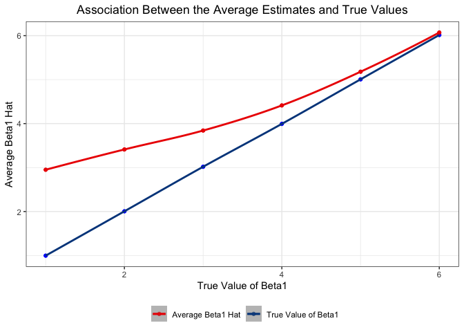

p8105\_hw5\_zl2860
================
Zongchao Liu
11/1/2019

# Load data

``` r
# Load data
set.seed(10)

iris_with_missing = iris %>% 
  map_df(~replace(.x, sample(1:150, 20), NA)) %>%
  mutate(Species = as.character(Species))
```

# Problem 1

``` r
# create a filled-in dataset
fill_in <-
  function(vec){ # vector as the argument
    if (is.numeric(vec)) {
      mean_vec = mean(vec, na.rm = TRUE)
      vec = replace_na(vec,round(mean_vec, digits = 1))# mean is rounded
    }
    else if (is.character(vec)) {
      vec = replace_na(vec, "virginica") #  fill in missing values with "virginica"
    }
    else{
      warning("Error: Unexpected data type. This function is only for filling in missing values of numeric and character data. ")
    }
  }

data_filled <-
  map_df(iris_with_missing, fill_in) # apply the function to the data

# check if missing values are replaced
skimr::skim(data_filled)
```

    ## Skim summary statistics
    ##  n obs: 150 
    ##  n variables: 5 
    ## 
    ## ── Variable type:character ──────────────────────────────────────────────────────────────────────────────────────────────────────────────
    ##  variable missing complete   n min max empty n_unique
    ##   Species       0      150 150   6  10     0        3
    ## 
    ## ── Variable type:numeric ────────────────────────────────────────────────────────────────────────────────────────────────────────────────
    ##      variable missing complete   n mean   sd  p0  p25 p50  p75 p100
    ##  Petal.Length       0      150 150 3.77 1.6  1   1.7  4   4.97  6.9
    ##   Petal.Width       0      150 150 1.19 0.72 0.1 0.4  1.2 1.8   2.5
    ##  Sepal.Length       0      150 150 5.82 0.78 4.3 5.12 5.8 6.38  7.9
    ##   Sepal.Width       0      150 150 3.08 0.4  2   2.82 3.1 3.27  4.4
    ##      hist
    ##  ▇▁▁▆▆▆▃▁
    ##  ▇▁▁▇▃▃▂▂
    ##  ▂▆▃▇▃▃▁▁
    ##  ▁▂▃▇▂▂▁▁

As the summary of the data shows, missing values are replaced by the
defined rules.

# Problem 2

## Load and tidy the data

``` r
file_names = list.files("./data/") # create a list of filenames

study_data <-
  tibble( file_names = file_names) %>%
  bind_cols(map_df(str_c("./data/", file_names), read_csv)) %>% # read and save the result in the created dataframe
  separate(file_names, into = c("arm", "id")) # tidy the data, including the subject ID, arm, and observations over time
```

### The complete data after being tidied

``` r
study_data %>% # show the complete data
  knitr::kable()
```

| arm | id | week\_1 | week\_2 | week\_3 | week\_4 | week\_5 | week\_6 | week\_7 | week\_8 |
| :-- | :- | ------: | ------: | ------: | ------: | ------: | ------: | ------: | ------: |
| con | 01 |    0.20 |  \-1.31 |    0.66 |    1.96 |    0.23 |    1.09 |    0.05 |    1.94 |
| con | 02 |    1.13 |  \-0.88 |    1.07 |    0.17 |  \-0.83 |  \-0.31 |    1.58 |    0.44 |
| con | 03 |    1.77 |    3.11 |    2.22 |    3.26 |    3.31 |    0.89 |    1.88 |    1.01 |
| con | 04 |    1.04 |    3.66 |    1.22 |    2.33 |    1.47 |    2.70 |    1.87 |    1.66 |
| con | 05 |    0.47 |  \-0.58 |  \-0.09 |  \-1.37 |  \-0.32 |  \-2.17 |    0.45 |    0.48 |
| con | 06 |    2.37 |    2.50 |    1.59 |  \-0.16 |    2.08 |    3.07 |    0.78 |    2.35 |
| con | 07 |    0.03 |    1.21 |    1.13 |    0.64 |    0.49 |  \-0.12 |  \-0.07 |    0.46 |
| con | 08 |  \-0.08 |    1.42 |    0.09 |    0.36 |    1.18 |  \-1.16 |    0.33 |  \-0.44 |
| con | 09 |    0.08 |    1.24 |    1.44 |    0.41 |    0.95 |    2.75 |    0.30 |    0.03 |
| con | 10 |    2.14 |    1.15 |    2.52 |    3.44 |    4.26 |    0.97 |    2.73 |  \-0.53 |
| exp | 01 |    3.05 |    3.67 |    4.84 |    5.80 |    6.33 |    5.46 |    6.38 |    5.91 |
| exp | 02 |  \-0.84 |    2.63 |    1.64 |    2.58 |    1.24 |    2.32 |    3.11 |    3.78 |
| exp | 03 |    2.15 |    2.08 |    1.82 |    2.84 |    3.36 |    3.61 |    3.37 |    3.74 |
| exp | 04 |  \-0.62 |    2.54 |    3.78 |    2.73 |    4.49 |    5.82 |    6.00 |    6.49 |
| exp | 05 |    0.70 |    3.33 |    5.34 |    5.57 |    6.90 |    6.66 |    6.24 |    6.95 |
| exp | 06 |    3.73 |    4.08 |    5.40 |    6.41 |    4.87 |    6.09 |    7.66 |    5.83 |
| exp | 07 |    1.18 |    2.35 |    1.23 |    1.17 |    2.02 |    1.61 |    3.13 |    4.88 |
| exp | 08 |    1.37 |    1.43 |    1.84 |    3.60 |    3.80 |    4.72 |    4.68 |    5.70 |
| exp | 09 |  \-0.40 |    1.08 |    2.66 |    2.70 |    2.80 |    2.64 |    3.51 |    3.27 |
| exp | 10 |    1.09 |    2.80 |    2.80 |    4.30 |    2.25 |    6.57 |    6.09 |    4.64 |

### The data including only the control arm with subject ID

``` r
data_con <- 
  study_data %>%
  filter(arm == "con")
data_con %>% # only include control arm
  knitr::kable()
```

| arm | id | week\_1 | week\_2 | week\_3 | week\_4 | week\_5 | week\_6 | week\_7 | week\_8 |
| :-- | :- | ------: | ------: | ------: | ------: | ------: | ------: | ------: | ------: |
| con | 01 |    0.20 |  \-1.31 |    0.66 |    1.96 |    0.23 |    1.09 |    0.05 |    1.94 |
| con | 02 |    1.13 |  \-0.88 |    1.07 |    0.17 |  \-0.83 |  \-0.31 |    1.58 |    0.44 |
| con | 03 |    1.77 |    3.11 |    2.22 |    3.26 |    3.31 |    0.89 |    1.88 |    1.01 |
| con | 04 |    1.04 |    3.66 |    1.22 |    2.33 |    1.47 |    2.70 |    1.87 |    1.66 |
| con | 05 |    0.47 |  \-0.58 |  \-0.09 |  \-1.37 |  \-0.32 |  \-2.17 |    0.45 |    0.48 |
| con | 06 |    2.37 |    2.50 |    1.59 |  \-0.16 |    2.08 |    3.07 |    0.78 |    2.35 |
| con | 07 |    0.03 |    1.21 |    1.13 |    0.64 |    0.49 |  \-0.12 |  \-0.07 |    0.46 |
| con | 08 |  \-0.08 |    1.42 |    0.09 |    0.36 |    1.18 |  \-1.16 |    0.33 |  \-0.44 |
| con | 09 |    0.08 |    1.24 |    1.44 |    0.41 |    0.95 |    2.75 |    0.30 |    0.03 |
| con | 10 |    2.14 |    1.15 |    2.52 |    3.44 |    4.26 |    0.97 |    2.73 |  \-0.53 |

## Make a Spaghetti Plot

``` r
plot_abv <-
study_data %>%
  pivot_longer( week_1 : week_8,
                names_to = "week",
                names_prefix = "week_",
               values_to = "observations") %>%
  mutate(arm_id = str_c(arm,id)) %>%
  ggplot(aes( x = week, y = observations, color = id, group = arm_id)) +
  geom_line() +
  geom_point(aes(shape = arm)) +
  ggsci::scale_color_jco() +
  facet_grid(. ~ arm) +
  theme_bw() +
  labs( title = "The Spaghetti Plot Showing Observations on Each Subject Over Time",
        x = "Week",
        y = "Observations") +
  theme(plot.title = element_text(hjust = .5),
        legend.position = "bottom") 

plot_btm <-
study_data %>%
  pivot_longer( week_1 : week_8,
                names_to = "week",
                names_prefix = "week_",
               values_to = "observations") %>%
  mutate(arm_id = str_c(arm,id)) %>%
  ggplot(aes( x = week, y = observations, color = arm, group = arm_id)) +
  geom_line() +
  geom_point(aes(shape = arm), size = 2) +
  ggsci::scale_color_jco() +
  theme_bw()

plot_abv/plot_btm
```

<!-- -->

From the plot above, we see that over the 8 weeks the average
observation on the subjects in experimental arm is higher than that on
the subjects in control arm. Also, over the 8 weeks, the observed values
on the subjects in experimental arm have an significant increasing trend
while the observed values in control arm just fluctuate within a range
(0 ~ 2.5), implying that there is no significant change of the observed
values.

# Problem 3

## Build the model and get the estimate results

``` r
set.seed(886) # ensure reproducible

# buid a function which returns a df of the information of the fitted model
slr_func <- 
  function(beta_1){
    n = 30
    beta_0 = 2
    sigma_squared = 50 #local defalut settings, we only change beta_1 later 
    
    sim_data =  
     tibble(
       x = rnorm(n),
       y = beta_0 + beta_1*x + rnorm(n, mean = 0, sd = sqrt(sigma_squared))) # create raw data for regression
   
   fit = lm(y ~ x, sim_data) # fit model
   
   fit %>%
     broom::tidy() %>%
     select(term,estimate, p.value) %>%
     filter(term == "x") %>%
     mutate(term = recode(term, "x" = "beta_1_hat")) #tidy the results
  } 


# generate 10000 datasets
model_10000 <-
  rerun(10000, slr_func(beta_1 = 0)) %>%
  bind_rows() 

# Repeat the above for β1={1,2,3,4,5,6}
repeated_beta_1 <- 
  tibble(beta_1 = c(1:6)) %>%
  mutate(output_list = map(.x = beta_1, ~rerun(10000, slr_func(beta_1 = .x ))),
         output_dfs = map(output_list,bind_rows)) %>%
  select(-output_list) %>%
  unnest(output_dfs) %>%
  pivot_wider( names_from = term,
               values_from = estimate) %>%
  janitor::clean_names()
```

## A plot showing the association between effect size and power

``` r
repeated_beta_1 %>%
  group_by(beta_1) %>%
  summarize(prop_rejected = sum(p_value < 0.05)/n()) %>%
  ggplot(aes( y = prop_rejected, x = beta_1)) +
  geom_point() +
  geom_smooth() +
  theme_bw() +
  labs( title = "Association Between Effect Size and Power",
        x = "True Value of Beta1",
        y = "Power") +
  theme(plot.title = element_text(hjust = .5))
```

<!-- -->

From the plot above, we see that as β1 (effect size) increases, the
power correspondingly increases. However, the increasing rate of power
is gradually decreasing as β1
increases.

## Make a plot showing the average estimate of β̂ 1 on the y axis and the true value of β1 on the x axis

``` r
all_avg <-
  repeated_beta_1 %>%
  group_by(beta_1) %>%
  summarize(avg_beta_hat = mean(beta_1_hat)) # calculation for the plot
  

rejected_avg <- 
  repeated_beta_1 %>%
  mutate(rejection = ifelse( p_value < 0.05, "yes", "no")) %>%
  filter( rejection == "yes") %>%
  group_by(beta_1) %>%
  summarize(avg_beta_hat = mean(beta_1_hat)) # calculation for the plot
  

ggplot() + 
  geom_point(aes(x = beta_1, y = avg_beta_hat), data = all_avg, color = "blue") +
  geom_smooth(aes(x = beta_1, y = avg_beta_hat, color = "blue"),data = all_avg) +
  geom_point(aes(x = beta_1, y = avg_beta_hat, color = "red"), data = rejected_avg) +
  geom_smooth(aes(x = beta_1, y = avg_beta_hat, color = "red"), data = rejected_avg) +
  theme_bw() +
  labs( title = "Association Between the Average Estimates and True Values",
        y = "Average Beta1 Hat",
        x = "True Value of Beta1") +
  theme(plot.title = element_text(hjust = .5),
        legend.position = "bottom",
        legend.title = element_blank()) +
  ggsci::scale_color_lancet(breaks = c("red", "blue"),
                       labels = c( "Average Beta1 Hat", "True Value of Beta1"),
                       guide = "legend")
```

<!-- -->

The sample average of β̂1 across tests for which the null is rejected is
always higher than the true value of β1. However, as the true value
increases, the sample average of β̂1 gradually approxiates the true
value.

As we see in the first plot, when the true β1 is small, the power is
also low. Therefore, given the null hypothesis β1 = 0 is FAlSE, the
probability that a sampling result may reject H0 is relatively small.
Hence, a greater “observed β̂1” is needed to reject the" FALSE" null
hypothesis. However, as the true value of β increases, the power also
increases, which means it becomes easier for a relatively small "
observed β̂1 " to reject null hypothesis. That’s why as the true value
increases, the sample average of β̂1 gradually approximates the true
value.
